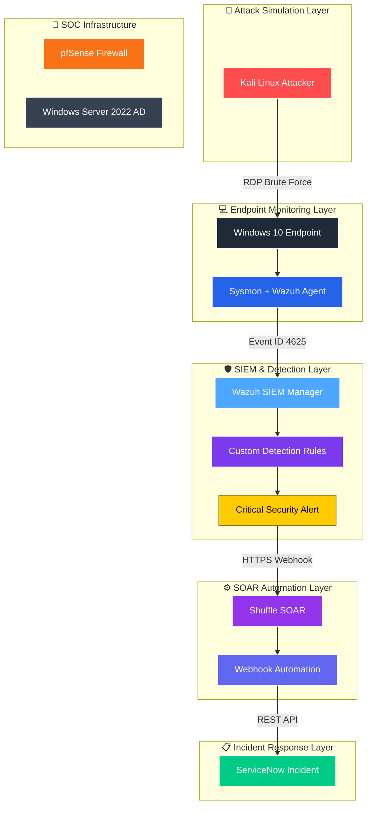

# SOC Home Lab: Production-Grade Security Operations Center
# 🛡️ SOC Operations Lab (SOL) Home Lab
*Enterprise-Grade Automated Security Operations Center & Incident Response Pipeline*

[](LICENSE)
[]()
[]()

## 📝 Executive Summary
This repository contains a modular, virtualized Security Operations Center (SOC) environment designed to simulate enterprise-grade threat detection, log analysis, and incident response orchestration. It demonstrates **Detection-as-Code** principles by bridging the gap between raw endpoint telemetry and automated SOAR response workflows.

**The core value proposition:** This lab reduces Mean Time To Detect (MTTD) and Mean Time To Respond (MTTR) by orchestrating Wazuh alerts through Shuffle SOAR to trigger automated ServiceNow incident creation.

---

## 🏗️ Architecture Blueprint
*The environment utilizes a segmented virtual network (pfSense) to facilitate secure log transit from isolated endpoints to the central SIEM.*

[**Read the full Architecture Design**](docs/architecture/system-design.md)


📋 Prerequisites

Before deploying the lab, ensure your host environment meets these requirements:
1. Memory: 16GB+ RAM (Recommended for 4-5 concurrent VMs).
2. Storage: 100GB+ free SSD space.
3. Hypervisor: VMware Workstation Pro/Player or VirtualBox.
4. Network: Ability to create custom Host-Only network adapters.

🚀 Getting Started

1. Clone the Repository

git clone [https://github.com/Bommalimallesu/Autonomous SOC Home Lab.git](https://github.com/Bommalimallesu/Autonomous SOC Home Lab.git)
cd Autonomous SOC Home Lab

2. Environment Configuration (Security)

#Create your local environment file from the template
cp config/servicenow/.env.example config/servicenow/.env

#Edit .env with your actual API credentials.
#WARNING: Ensure .env is added to your .gitignore. Never push this file!

3. Execution & Deployment

#Make the deployment script executable
chmod +x scripts/automation/deploy-wazuh.sh

#Run the deployment
sudo bash scripts/automation/deploy-wazuh.sh

🚀 Key Features

1. Fully isolated network using pfSense and VMware Host-Only
2. Automated detection and response pipeline
3. Custom Wazuh detection rules with MITRE ATT&CK mapping
4. Zero-touch incident creation in ServiceNow via Shuffle SOAR
5. Comprehensive documentation and testing framework
6. Production-grade security practices (no hardcoded secrets)

🚀 Detection & Response Workflow

We prioritize high-fidelity alerting through a standardized, automated pipeline:

1. Ingestion: Endpoint (Sysmon/WinEvent) telemetry is captured via the Wazuh agent.

2. Detection: Wazuh Manager correlates logs against MITRE ATT&CK aligned rules.

3. Orchestration: Shuffle consumes the alert payload via Webhook.

4. Response: Automated incident ticket generation in ServiceNow.

🛠️ Technology Stack

| Component | Technology | Role |
| :--- | :--- | :--- |
| **SIEM** | Wazuh | Log Ingestion, Correlation, & XDR |
| **SOAR** | Shuffle | Workflow Automation & Orchestration |
| **ITSM** | ServiceNow | Incident Management |
| **Network** | pfSense | Perimeter Security & Segmentation |
| **Telemetry** | Sysmon | Advanced Windows Monitoring |

## 📁 Project Structure

```text
Autonomous-SOC-Home-Lab/
├── README.md
├── CHANGELOG.md
├── CONTRIBUTING.md
├── LICENSE
├── .gitignore
│
├── screenshots/
│   ├── wazuh-dashboard.png
│   ├── shuffle-workflow.png
│   └── servicenow-incident.png
│
├── docs/
│   ├── ARCHITECTURE.md
│   ├── SETUP.md
│   ├── TROUBLESHOOTING.md
│   ├── architecture/
│   │   ├── system-design.md
│   │   └── data-flow.md
│   ├── setup/
│   │   ├── pfsense-setup.md
│   │   ├── windows-server-setup.md
│   │   ├── wazuh-setup.md
│   │   └── automation-setup.md
│   └── troubleshooting/
│       ├── common-issues.md
│       └── solutions.md
│
├── config/
│   ├── wazuh/
│   │   ├── ossec.conf
│   │   ├── rules-custom.xml
│   │   └── integration-shuffle.conf
│   ├── pfsense/
│   │   └── firewall-rules.txt
│   ├── windows-server/
│   │   └── ad-setup.ps1
│   └── servicenow/
│       └── incident-template.json
│
├── scripts/
│   ├── integration/
│   │   ├── custom-shuffle.py
│   │   └── servicenow-api.py
│   ├── automation/
│   │   ├── deploy-wazuh.sh
│   │   └── configure-agents.ps1
│   └── testing/
│       ├── test-webhook.sh
│       └── test-integration.py
│
├── diagrams/
│   ├── architecture/
│   │   ├── system-overview.txt
│   │   └── data-flow.txt
│   ├── network/
│   │   └── network-topology.txt
│   └── workflow/
│       └── soar-workflow.txt
│
├── examples/
│   ├── alerts/
│   │   └── sample-alert.json
│   ├── incidents/
│   │   └── sample-incident.json
│   └── logs/
│       └── sample-logs.txt
│
└── tests/
    └── integration/
        └── e2e-test.sh
```
🔄 Detection & Response Workflow

Kali Linux Attack → Windows Event ID 4625 → Wazuh Detection 
→ Shuffle SOAR Webhook → Automated ServiceNow Incident

🧠 Skills Demonstrated

1. Enterprise SOC Architecture
2. SIEM Administration & Detection Engineering
3. SOAR Automation & Orchestration
4. Incident Response Automation
5. Security Tool Integration
6. Blue Team Operations

🤖 Future Enhancements

1. Sigma Rule Integration
2. Active Response & Automated Containment
3. Threat Intelligence Enrichment
4. Advanced Analytics & Visualizations

👤 Author
🧑‍💻 Bommali Mallesu
🛡️ 🧑‍💻 Cybersecurity Engineer | SOC Analyst | SIEM & SOAR Automation Developer
📍 SOC Home Lab Project Maintainer
📅 Last Updated: May 26, 2026

This laboratory environment demonstrates real-world enterprise SOC capabilities with production-grade standards and security best practices.
